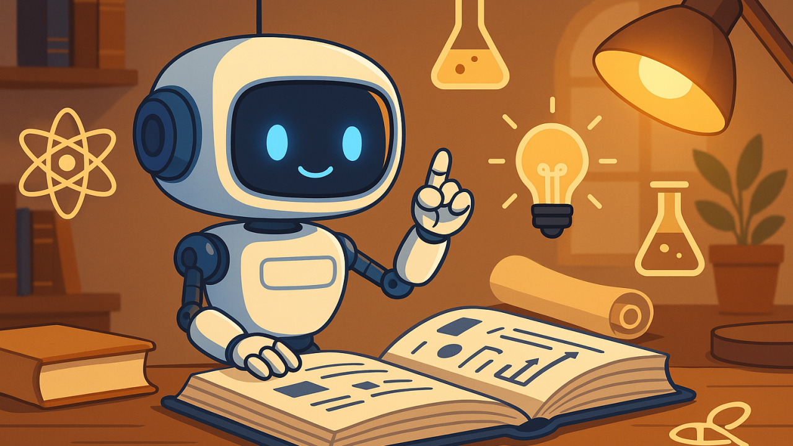

# 📚 **RAG Demo: Business Analysis PDF**

This is a simple but complete **Retrieval-Augmented Generation (RAG)** demo. It uses a PDF textbook on _business analysis_ as its knowledge source. The system can answer English questions by retrieving relevant parts of the document and generating answers using a language model.

  

## **How it works**

1. **PDF loading and processing**  
   The business analysis textbook is downloaded, split into pages and sentences.

2. **Chunking and embeddings**  
   Sentences are grouped into chunks (e.g. 5 per group). These chunks are turned into embeddings using `sentence-transformers`.

3. **Question embedding and retrieval**  
   When the user asks a question, it is also embedded and compared to the chunks to find the most relevant context.

4. **LLM answer generation**  
   The top relevant chunks are passed to an LLM (Zephyr 7B), which generates a natural language answer.

5. **PDF page visualization**  
   The original PDF page that contains the relevant answer is shown next to the response.

## **What does the RAG "know"?**

The model has not been trained in the usual machine learning sense — instead, it "knows" the content of a specific English textbook on **business analysis**, thanks to embedding-based retrieval. This is why you can ask domain-specific questions like:

- What is Porter's Value Chain?
- What are value propositions?
- What factors influence competition?

## **Why we use `HuggingFaceH4/zephyr-7b-beta`**

This model was selected because:

- It’s accessible via Hugging Face Inference API
- Small enough for real-time demo usage
- Supports chat-style formatting with strong general reasoning skills

It balances **response quality, cost, and runtime constraints**, which makes it ideal for portfolio projects and small-scale production demos.

## **Try it live**

👉 [Hugging Face Space](https://huggingface.co/spaces/DanielSokach/RAG)

## **Example questions**

- What is Porter's Value Chain?
- What is a value proposition?
- How do substitutes affect competition?
- What are switching costs?

## **Technology stack**

- Python 3
- Gradio 5 (UI)
- Sentence Transformers (`all-mpnet-base-v2`)
- Transformers / Hugging Face Inference API
- PyMuPDF (PDF parsing)

## **Data source**
Paul, D., Cadle, J., & Yeates, D. (Eds.). (2014). Business analysis (3rd ed.). BCS, The Chartered Institute for IT. https://nibmehub.com/opac-service/pdf/read/Business%20Analysis.pdf
